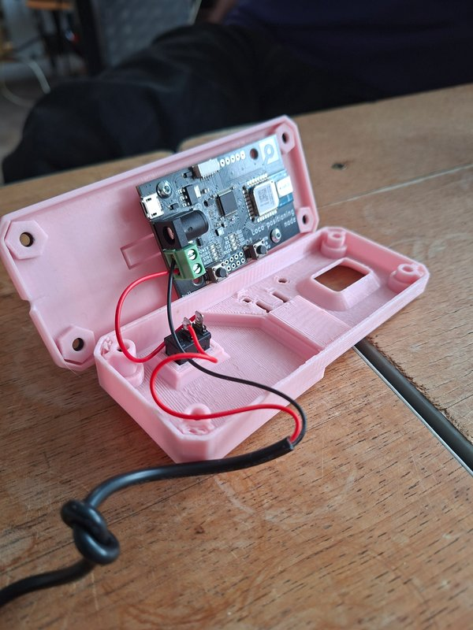

# 3D Printable Case for the LPS Node

## Overview

- **Files**:
    - [Front.stl](Front.stl)
        - Front shell of the enclosure (contains hole for the UWB)
    - [Back.stl](Back.stl)
        - Back shell of the enclosure (holds the LPS node PCB)
    - [Adapter.stl][Adapter.stl]
        - Adapter for mounting
- **Parts List**: See the full parts list [here](Parts-List.txt)

*Design by:* [albrecht.mx](https://albrecht.mx)

These files may be freely printed.

## Printer Settings

Tested:
- Adapter: (Layer Height: 0.1mm, Infill Density: 10%, Pattern: Grid, Material: PLA)

## Assembly

|  |  |
| ------------------------------------------------------------ | --------------------------------------------------------- |
| 1) Place the LPS node PCB into the **back** part of the case. 2) Connect and solder the USB power cable wires. 3) Lay down the USB cable on top of the designated notch in the **back** part. 4) Attach the **front** part and secure it with screws. 5) Use the **adapter** to mount the case on a tripod. |  |

[Adapter.stl]: Adapter.stl

